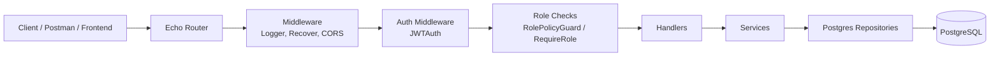
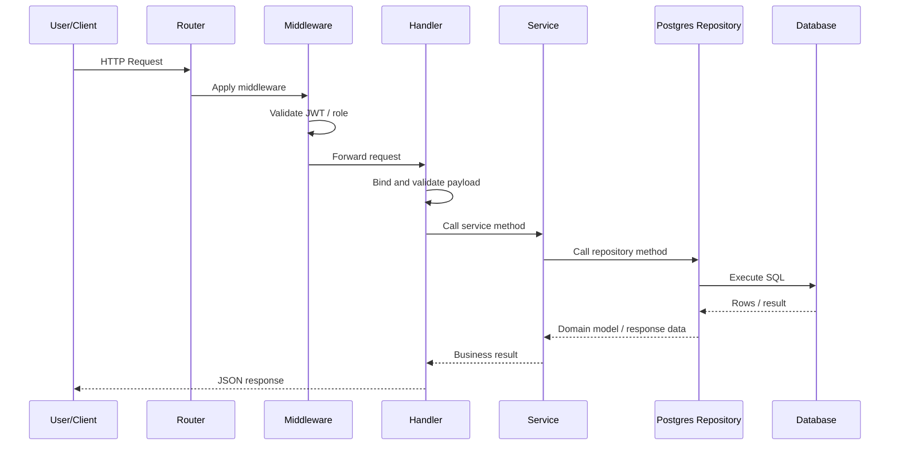
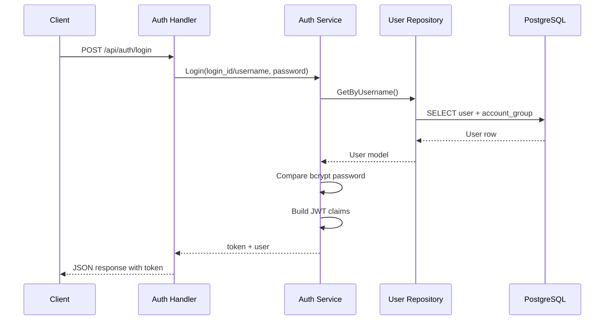
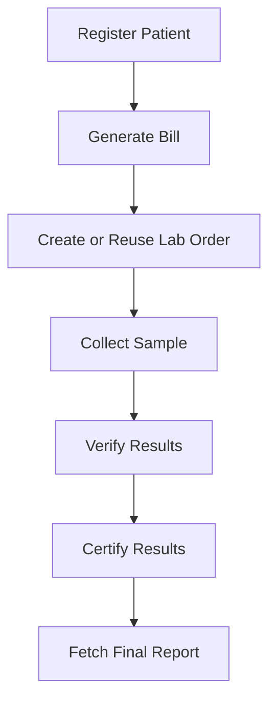
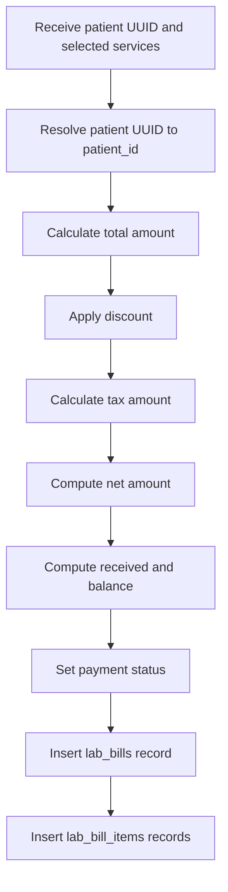
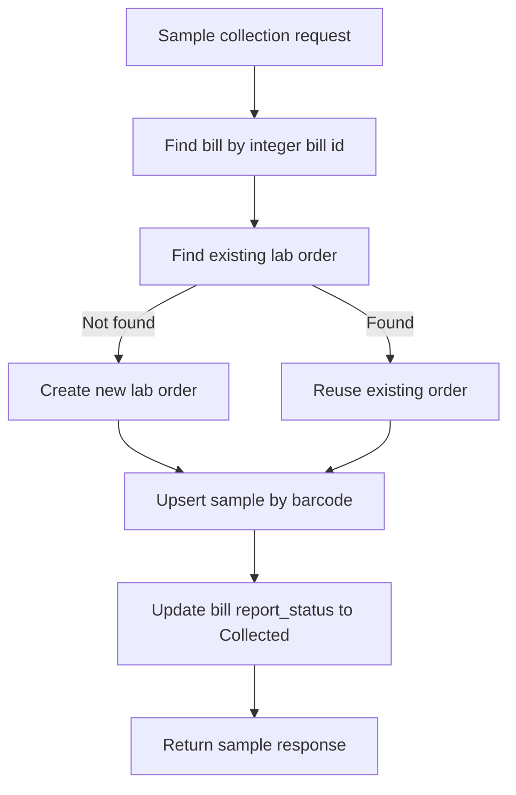
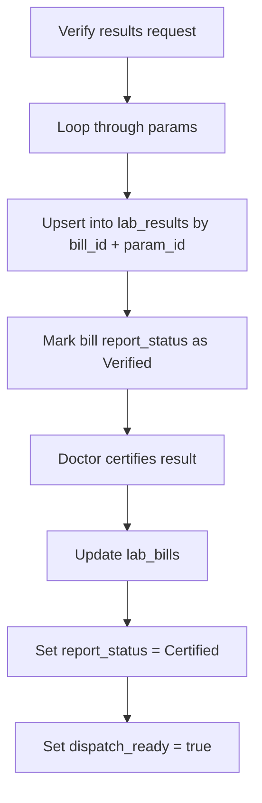
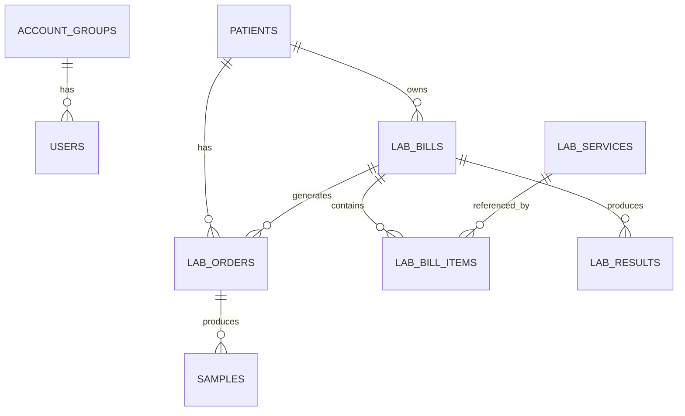

# CPRT LIS Flow Diagrams

This file is the quick visual companion to the main KT document. It shows how the application is structured, how requests move through the code, and how the core lab workflow moves from patient registration to final report generation.

## 1. Application Architecture

The code follows a clean layered structure. Handlers deal with HTTP, services coordinate business operations, repositories hold raw SQL, and PostgreSQL is the single source of truth.

## 2. Request Flow Inside the Code

Most business rules are implemented close to the handler and repository layers. Services are intentionally thin, so most debugging usually starts in the handler for input issues or in the repository for SQL and data issues.

## 3. Authentication Flow

Login supports `login_id`, `username`, or email lookup in the repository. After successful bcrypt verification, the service issues an HS256 JWT containing the user UUID, role, and group ID.

## 4. Patient to Report Workflow

This is the main business flow of the project. Almost every operational use case falls somewhere in this chain, so this is the best mental model for onboarding someone new.

## 5. Billing Flow

The `GenerateBill` path is the main billing implementation. It runs in a transaction and calculates totals before storing both the bill header and bill items.

## 6. Lab Sample Collection Flow

Sample collection is resilient to missing orders because it auto-creates a `lab_orders` row when needed. The sample is upserted using the barcode, which means repeating the same sample number updates the existing row instead of duplicating it.

## 7. Result Verification and Certification Flow

Verification stores or updates individual result parameters, while certification is the doctor sign-off step that marks the bill as ready for dispatch. The unique index on `lab_results(bill_id, param_id)` is what makes repeated verification idempotent per parameter.

## 8. Database Relationship View

The operational center of the schema is `lab_bills`. It connects patient registration, billing, ordering, sample handling, and result reporting into one traceable workflow.
